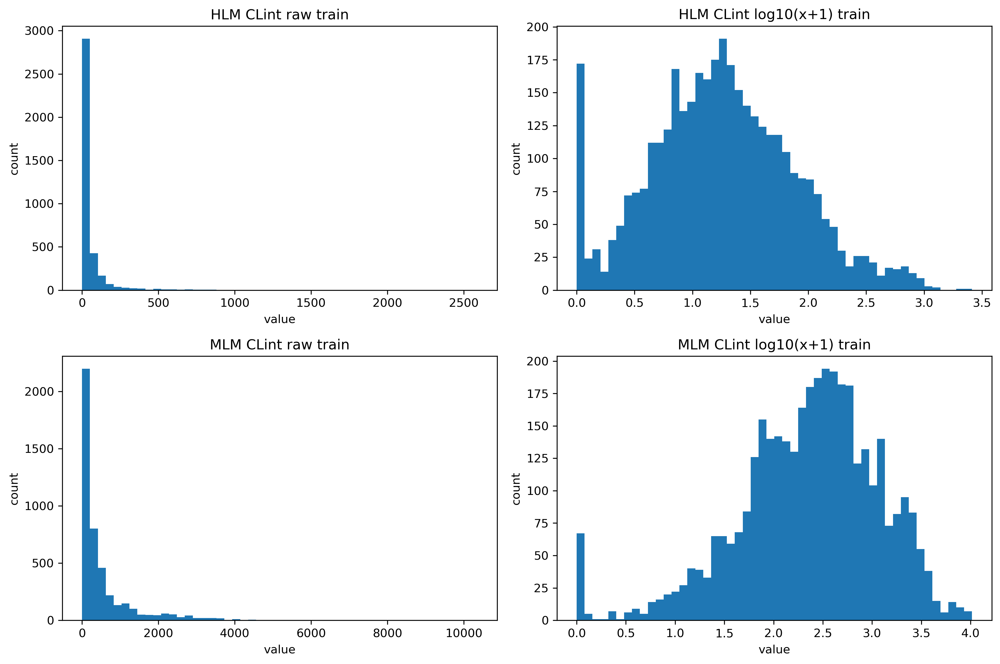
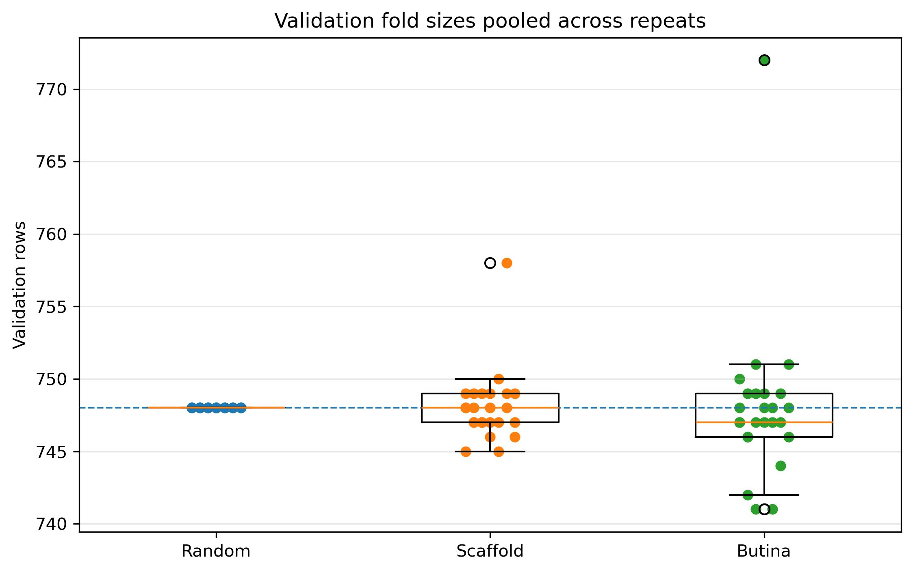
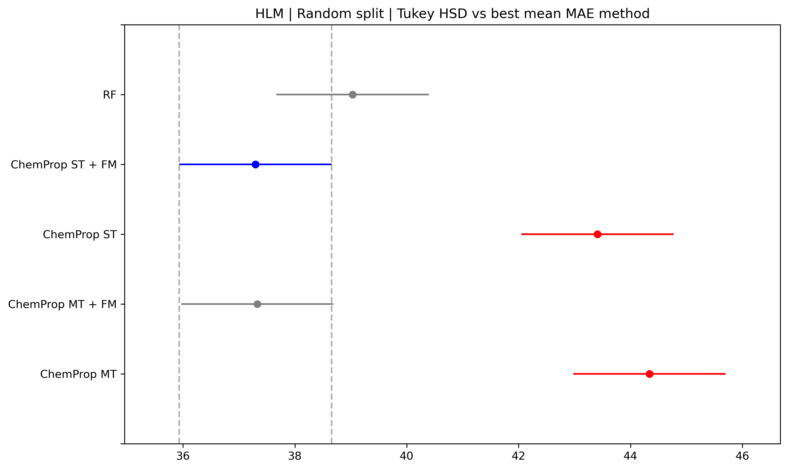
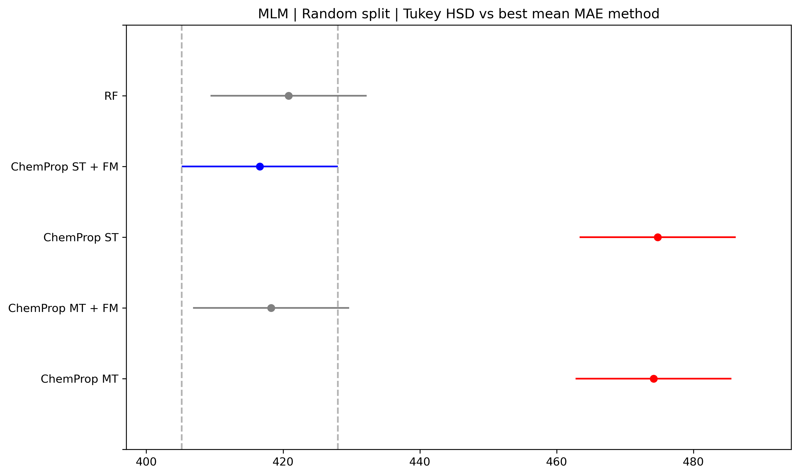
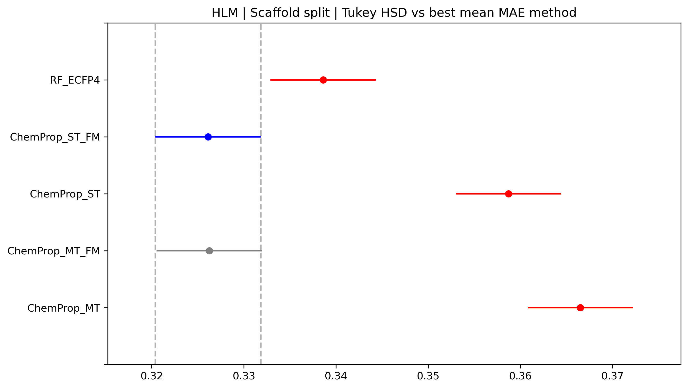
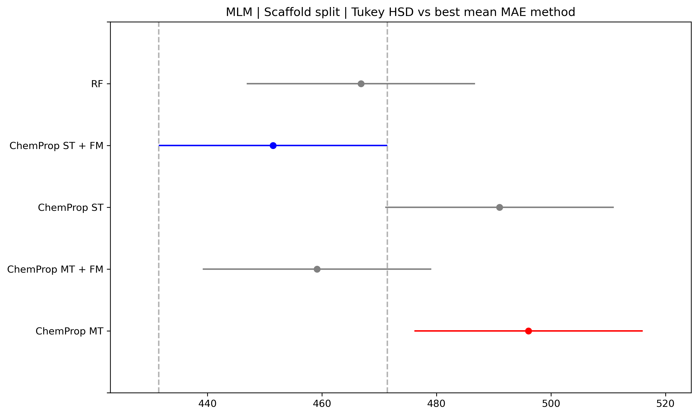
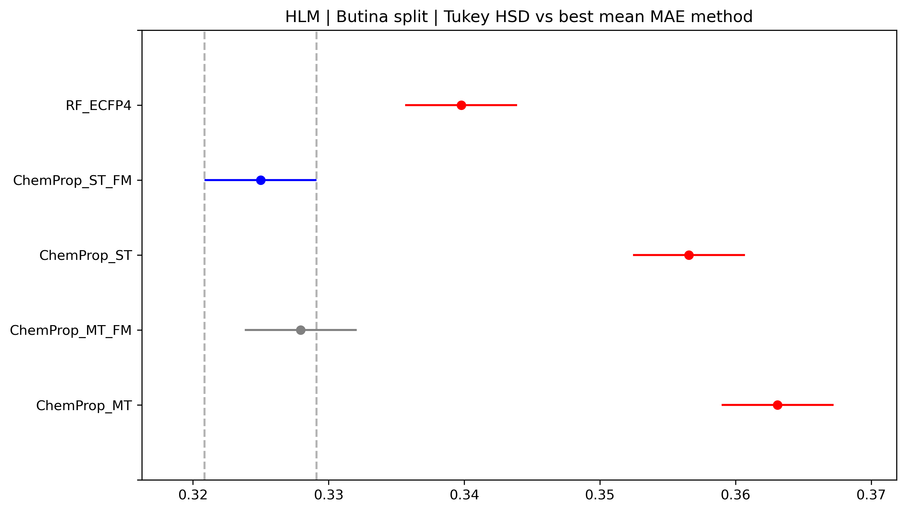
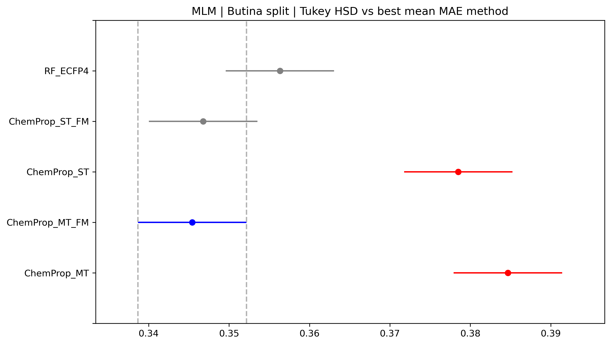
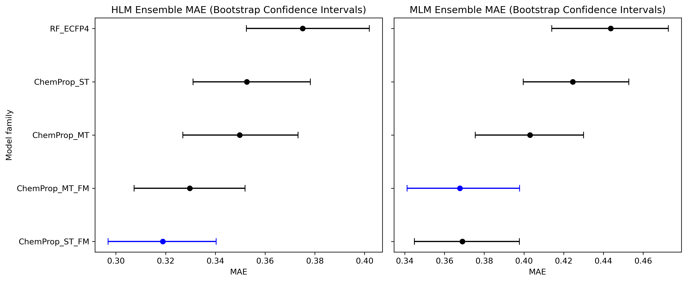

# Background

Previously, I explored using [using a a foundation model, CheMeleon, for ADMET modeling](https://github.com/DKchemistry/pretrain-vs-scratch-admet). However, there were a few things I think should have been done differently and Pat Walters was very kind to leave some [feedback](https://www.linkedin.com/feed/update/urn:li:activity:7430614476992700417/). The first being that AquaSolDB doesn't have homogenous assay conditions, which introduces unnecessary noise compared to using a dataset produced by a consistent lab. Two such sources of that data that would have been better could be the Biogen dataset ([paper](https://pubs.acs.org/doi/10.1021/acs.jcim.3c00160), [dataset](https://polarishub.io/datasets/biogen/adme-fang-v1)) and/or the [OpenADMET-ExpansionRx dataset](https://huggingface.co/spaces/openadmet/OpenADMET-ExpansionRx-Challenge). The second being that I didn't evaluate statistical significance between methods. Pat has written about this [here](https://practicalcheminformatics.blogspot.com/2025/03/even-more-thoughts-on-ml-method.html) and this recent(ish) paper from Ash et al also go through best practices in the field ([Practically significant method comparison protocols for machine learning in small molecule drug discovery](https://pubs.acs.org/doi/10.1021/acs.jcim.5c01609)). In this exploratory repo, I'd like to do better on those two fronts. 

At the same time, I may have gotten ahead of my skis a bit, as I was also interested in a few other topics. In the commentary post by the OpenADMET team ([Lessons Learned from the OpenADMET ExpansionRx Blind Challenge](https://openadmet.ghost.io/lessons-learned-from-the-openadmet-expansionrx-blind-challenge/)), multitask GNNs are stated as being the undisputed winners of this challenge and are well represented in the leaderboard. I tried working with multitask models during my PhD, but they weren't very successful in my hands, so I wanted to try them again, as they are easy to implement in chemprop. Additionally, there were a variety of data splitting strategies used by the competitors, whereas my previous exploration demo only considered a single scaffold split. I figured HLM and MLM might be tasks that might benefit from multitask approaches, which was also done by the first place team from Inductive Bio (though I believe they also included LogD as an auxillary task). Serendipitously, the OpenADMET team recently wrote about HLM/MLM [here](https://openadmet.ghost.io/a-hot-fresh-new-clearance-model-2/) as I was working on this. I really love this post as it is very well written and covers not only the modelling practicalities but the chemistry/biology/drug discovery aspects of how these endpoints are measured and what the data means in a practical sense. I really recommend it! Finally, I watched some webinars that touched on data splitting, saw this paper from Guo et al ([Scaffold Splits Overestimate Virtual Screening Performance](https://arxiv.org/abs/2406.00873)), and some commentary from Pat ([Some Thoughts on Splitting Chemical Datasets](https://practicalcheminformatics.blogspot.com/2024/11/some-thoughts-on-splitting-chemical.html))

Putting this together, I wanted to try to answer this hypothetical question: 

> "In the context of the HLM/MLM data available from OpenADMET-ExpansionRx, what splitting strategy used on the training data would best inform me of which modelling approach would be most ideal for submitting predictions to the competition?"

Writing this up in retrospect, this was a tougher question to answer than I thought, and ultimately - I am not sure of how good of a question this was. On the plus side, I did learn somethings in the process, realize some (computationally) costly mistakes, and at least better understand what it is that I don't know. So I do not think this is all for naught :) 

To better formulate what I think went well and what I think went wrong, let's walk through the process. 

## Data Aquistion & Preparation

First, we need to fetch the relevant HLM and MLM data.

```sh
conda activate admet-data
python scripts/fetch_hlm_mlm_dataset.py
```

This code just grabs the relevant data (excluding "censored" data, e.g. `>`, `<`) and gives an initial view of what the data looks like: 

```sh
Wrote:
 - data/raw/hlm_mlm_train.csv: (5326, 3)
 - data/raw/hlm_mlm_test.csv:  (2282, 3)

Missing labels in TRAIN:
HLM CLint    1567
MLM CLint     804

Missing labels in TEST:
HLM CLint    1500
MLM CLint    1112
```

Outside of the obvious fact that not all compounds have HLM/MLM measurements, we can also see that they aren't always paired measurements. AFAIK, chemprop does have ways of masking non-existent labels when computing loss, but I didn't want to add that complexity at this stage. So, I wanted to filter the data to only retain compounds that contained both measurements.

Additionally, my understanding is that its typically helpful to log transform assay data as it can be highly skewed and contain extreme outliers, which can make it harder to learn and drop prospective performance. I wasn't sure how to handle the case where data is 0 (in this case, no detectable clearence). When asking this question to the OpenADMET team, Hugo MacDermott-Opeskin kindly responded: 

> "we often use a log10+1 transform analogous to https://numpy.org/doc/stable/reference/generated/numpy.log1p.html but in base 10 to get around this issue."

So, we'll go with that! One thing to keep in mind is to transform your predictions back if you wanted to submit to the leaderboard.

```sh
python scripts/process_dataset.py \
  --train_csv data/raw/hlm_mlm_train.csv \
  --test_csv data/raw/hlm_mlm_test.csv \
  --out_dir data/processed \
  --out_prefix hlm_mlm \
  --y_cols "HLM CLint,MLM CLint" \
  --log10
```

```
Wrote:
  data/processed/hlm_mlm_paired_log10_train.csv shape= (3740, 3)
  data/processed/hlm_mlm_paired_log10_test.csv shape= (533, 3)
```

We can take a quick look at the effect of this transform here, the data certainly looks more normally distributed: 

```sh
python scripts/plot_label_distributions.py \
  --raw_train_csv data/raw/hlm_mlm_train.csv \
  --processed_train_csv data/processed/hlm_mlm_paired_log10_train.csv \
  --y_cols "HLM CLint,MLM CLint" \
  --out_png figures/hlm_mlm_log10_distributions_train_only.png
```



## 5x5-CV by Different Split Strategies

Next, I wanted to do a 5x5-CV splits (80/20 train/val) using scaffold splits, butina cluster splits at a cut off of 0.3, and random splitting. UMAP splitting, as covered by Guo et al, could have also been used, but is absent here, as I'd like to understand how to implement it better before trying it. Pat and the corresponding author, Pedro Ballester, have a nice discussion about it in the comments of this [blog post](https://practicalcheminformatics.blogspot.com/2024/11/some-thoughts-on-splitting-chemical.html) I mentioned earlier.

```sh
python scripts/make_scaffold_cv5x5.py \
  --input_csv data/processed/hlm_mlm_paired_log10_train.csv \
  --out_splits data/splits/hlm_mlm_scaffold_5x5cv/scaffold_assignments.csv \
  --out_cv_root data/splits/hlm_mlm_scaffold_5x5cv/folds \
  --n_folds 5 \
  --n_repeats 5
```

```sh
python scripts/make_butina_cv5x5.py \
  --input_csv data/processed/hlm_mlm_paired_log10_train.csv \
  --out_splits data/splits/hlm_mlm_butina_5x5cv/cluster_assignments.csv \
  --out_cv_root data/splits/hlm_mlm_butina_5x5cv/folds \
  --n_folds 5 \
  --n_repeats 5 \
  --butina_dist_cutoff 0.3
```

```sh
python scripts/make_random_cv5x5.py \
  --input_csv data/processed/hlm_mlm_paired_log10_train.csv \
  --out_splits data/splits/hlm_mlm_random_5x5cv/random_assignments.csv \
  --out_cv_root data/splits/hlm_mlm_random_5x5cv/folds \
  --n_folds 5 \
  --n_repeats 5
```

Let's take a look at the average size of the validation set per split. Based on the logic of 5x5-CV scripts, which uses the scaffold/cluster to assign rows of molecules, we could run into dataset size imbalances if some scaffolds/clusters had a lot of members. Qualitatively, it seems we are fine: 



The splits we generate here can be used directly for RF, though not chemprop:

```sh
data/splits/hlm_mlm_butina_5x5cv
data/splits/hlm_mlm_random_5x5cv
data/splits/hlm_mlm_scaffold_5x5cv
```
## Model Training & Performance Metrics

We can take a look at one of the fold files to see how we'll set up our RF training code. We write out five iterations (iter0-iter4) where we each contains five fold assignments (fold0-fold4). Each fold essentially holds all the data we will need for an entire RF training and evaluation run. Let's look at this file as an example:

```sh
head data/splits/hlm_mlm_butina_5x5cv/folds/iter_0/fold_1.csv
SMILES,HLM CLint,MLM CLint,row_id,split
CN1CCC[C@H]1COc1ccc(-c2nc3cc(-c4ccc5[nH]c(-c6ccc(O)cc6)nc5c4)ccc3[nH]2)cc1,1.7589118923979734,2.2631624649622166,0,train
COc1ccc2c(c1)c1cc3cnccc3c(C)c1n2C,2.2079035303860515,3.13100881279064,1,train
CN(C)CC(O)COc1ccc2nc(-c3ccc(-c4nc5ccc(OCC(O)CN(C)C)cc5[nH]4)c(F)c3)[nH]c2c1,1.2988530764097066,1.81424759573192,2,val
COc1ccc(-c2nc3ccc(OCCCN(C)C)cc3[nH]2)cc1NC(=O)c1cccc(NC(=O)c2ncc[nH]2)c1,1.2013971243204515,1.826722520168992,3,train
Cc1ccc(-c2nc3ccccc3[nH]2)cc1NC(=O)c1cccc(-c2nc3cc(OCCCN(C)C)ccc3[nH]2)c1,1.2041199826559248,2.225309281725863,4,val
COc1ccc2nc(-c3ccc(-c4nc5ccc(OCCCC(=N)N)cc5[nH]4)cc3)[nH]c2c1,2.3879234669734366,1.8959747323590648,5,train
CN(C)CCCOc1ccc2nc(-c3cccc4nc(-c5ccncc5)[nH]c34)[nH]c2c1,0.9242792860618816,2.5352941200427703,6,train
CN(C)CCCOc1ccc(-c2nc3cc(-c4ccc5[nH]c(N)nc5c4)ccc3[nH]2)cc1,1.1818435879447726,1.9232440186302764,7,train
CN(C)CCCOc1ccc(-c2nc3cc(-c4ccc5[nH]cnc5c4)ccc3[nH]2)cc1,1.2988530764097066,2.5276299008713385,8,train

```

The `row_id` field is a hold over from how I split up the data, but the `split` field is what we will use to define what is `train` and what is `val` to fit the RF model. Really, `val` here should have been called `test` to make this more intuitive, which will become clearer when we get to chemprop. The following shell script calls the RF fitting/prediction/evaluation code for each of our three splitting strategies, treating everything as a single task prediction for HLM and MLM. We use `n_estimators=500`. I have a lot of CPU compute and an empty server thankfully, so this runs fairly quickly (~20 min for 150 models).

```sh
mkdir -p logs 
nohup bash -c 'time bash scripts/run_rf_ecfp4_5x5_cv_splits_comparison.sh' > logs/run_rf_ecfp4_5x5_cv_splits_comparison.log 2>&1 &
```

Now, let's collect the metrics we wrote for RF: 

Butina:

```sh
python scripts/collect_rf_cv_metrics.py \
  --metrics_root results/hlm_mlm_cv_compare/butina/rf_ecfp4 \
  --out_dir results/hlm_mlm_cv_compare/butina/rf_ecfp4/summary \
  --split_method Butina \
  --model_family RF_ECFP4
```

Random:

```sh
python scripts/collect_rf_cv_metrics.py \
  --metrics_root results/hlm_mlm_cv_compare/random/rf_ecfp4 \
  --out_dir results/hlm_mlm_cv_compare/random/rf_ecfp4/summary \
  --split_method Random \
  --model_family RF_ECFP4
```

Scaffold:

```sh
python scripts/collect_rf_cv_metrics.py \
  --metrics_root results/hlm_mlm_cv_compare/scaffold/rf_ecfp4 \
  --out_dir results/hlm_mlm_cv_compare/scaffold/rf_ecfp4/summary \
  --split_method Scaffold \
  --model_family RF_ECFP4
```

 The splits I used for RF won't work for chemprop as we need to add an "inner split", in which we reserve some portion of the fold training data as the validation set for early stopping, so the outer fold can be used as a testing set. We'll use 20% of the training data. This is why original 5x5-CV code really should have avoided calling rows `train` and `val` as opposed to `train` and `test`. 

```sh
python scripts/prepare_chemprop_inner_split.py \
  --input_fold_root data/splits/hlm_mlm_scaffold_5x5cv/folds \
  --output_root data/splits/hlm_mlm_scaffold_5x5cv_chemprop \
  --val_frac 0.2 \
  --seed 0

python scripts/prepare_chemprop_inner_split.py \
  --input_fold_root data/splits/hlm_mlm_butina_5x5cv/folds \
  --output_root data/splits/hlm_mlm_butina_5x5cv_chemprop \
  --val_frac 0.2 \
  --seed 0

python scripts/prepare_chemprop_inner_split.py \
  --input_fold_root data/splits/hlm_mlm_random_5x5cv/folds \
  --output_root data/splits/hlm_mlm_random_5x5cv_chemprop \
  --val_frac 0.2 \
  --seed 0
```
Now we will have folders with this structure: 

```sh
data/splits/hlm_mlm_scaffold_5x5cv_chemprop/iter_0/fold_0
├── test.csv
└── trainval.csv

1 directory, 2 files
```

The files will look very similar to before. A `trainval.csv` will still contain a split column with `train` and `val` values, except these new `val` rows are made by taking a random 20% of the rows that were originally labeled `train`. The `test.csv` file contains only the rows that were originally labeled `val` in the outer 5x5-CV run. 

Now, we can run our chemprop training! We are training 450 models here, which definitely takes some time. Before realizing I needed to carve out a validation set from the training folds, I ran all of them sequentially on 20 GB MIG instance of an A100 80GB GPU and it took about 4-5 days. The script below runs each model type (6 total, chemprop ST for HLM and MLM, chemprop ST with CheMeleon for HLM and MLM, chemprop MT HLM/MLM) in parallel on a MIG instance, so if you'd like to reproduce this, you'll need to modify the six `export CUDA_VISIBLE_DEVICES=` lines for your machine and/or switch it to sequential execution. 

```sh
nohup bash scripts/run_chemprop_5x5_cv_splits_comparison.sh \
  > logs/run_chemprop_5x5cv_corrected.log 2>&1 &
```

This took 1-2 days. Now we can collect these metrics. 

```sh
bash scripts/run_collect_chemprop_cv_metrics.sh
```

## Statistical Testing 

Let's try to implement the recommendations from [Practically Significant Method Comparison Protocols for Machine Learning in Small Molecule Drug Discovery](https://pubs.acs.org/doi/10.1021/acs.jcim.5c01609") by Ash et al to assess if, within a particular split (Random/Scaffold/Butina) our model families (RF/Chemprop variations) had statistically significant differences in terms of our model performances (MAE here). This is my first time trying to incorporate such an analysis, so caveat emptor regarding my reasoning: Given that we have followed **Guidelines 1** (5x5 CV for a dataset size between 500 and 100,000), we're going to assume that parametric tests are appropriate (there is additional discussion in the [SI](https://pubs.acs.org/doi/suppl/10.1021/acs.jcim.5c01609/suppl_file/ci5c01609_si_001.pdf) (Section C) and code examples [here](https://github.com/polaris-hub/polaris-method-comparison/blob/main/ADME_example/ML_Regression_Comparison.ipynb) regarding how one can check for the appropriateness of parametric tests more explicitly). The associated code is in `notebooks/5x5_cv_splits_stats.ipynb`. 

First we collect our result summary metrics (we keep more than MAE, but for now we will stick to this) and run repeated measures ANOVA via the [pingouin](https://pingouin-stats.org/generated/pingouin.rm_anova.html) library. It's very straightforward to use and plays nicely with pandas.  We find that at a p-value of 0.05, there is a significant differences between MAE in HLM/MLM tasks between the model families within a split. In some cases, sphericity is violated, and the Greenhouse-Geisser corrected p-value is used (p.s. as someone unfamiliar with these terms, I found these two videos intuitive: [1](https://www.youtube.com/watch?v=8BvlRJeCIaM), [2](https://www.youtube.com/watch?v=bUXdWUHJRqA)).

As I understand, repeated measures ANOVA only tells us that there is a difference between methods in the aggregate, but does not distinguish pairwise differences. To answer that, we can use the Tukey Honest Statistical Difference (HSD) test via the [statsmodels](https://www.statsmodels.org/dev/index.html) library. One nice thing about statsmodel's Tukey HSD is it can directly output plots in the style seen in Ash et al.

Let's look at how the models compare within a split.

### Random Splitting 



In random splitting for the HLM task, the MAE metrics are ordered best to worst as: ChemProp_ST_FM = ChemProp_MT_FM < RF_ECFP4 < ChemProp_ST < Chemprop_MT. FM here is foundation model (i.e., CheMeleon). Though, from this plot, it's only straightforward to compare ChemProp_ST_FM (the method with lowest mean MAE) to the rest; as the color coding is blue = method being compared, grey = statistically similar method to blue, red = statistically dissimilar to blue. We can consult the table in the jupyter notebook to see if we can reject the null for the comparison of ChemProp_ST and Chemprop_MT (we can indeed reject the null). 

A few things to note here. (1) This is partially why I think the question motivating this repo was flawed. As methods can be statistically similar, we can not confidently rank ChemProp_ST_FM as better than ChemProp_MT_FM here, which can make downstream comparisons difficult. There is however a bigger issue that we will get to later. (2) We do however see that the usage of the CheMeleon foundation model consistently outperforms de novo ChemProp and RF, which is interesting IMO. 

Let's see how MLM fares in this same split. 



We again see the improved MAE performance of the CheMeleon foundation model compared to de novo ChemProp, but not RF. Our rank ordering is, ChemProp_ST_FM = ChemProp_MT_FM = RF_ECFP4 < ChemProp_ST < Chemprop_MT. (When presenting rank orders, I am using the `reject` = `True`/`False` from the Tukey HSD tables to rank order performance in cases the plot is ambigious.)

### Scaffold Splitting 



For HLM scaffold splitting, MAE is rank ordered as: ChemProp_ST_FM = ChemProp_MT_FM < RF_ECFP4 < ChemProp_ST = Chemprop_MT.




For MLM scaffold splitting, MAE is rank ordered as: ChemProp_MT_FM = ChemProp_ST_FM = RF_ECFP4 < ChemProp_ST = Chemprop_MT.

### Butina Cluster Splitting 



For HLM butina splitting, MAE is rank ordered as ChemProp_ST_FM = ChemProp_MT_FM < RF_ECFP4 < ChemProp_ST = Chemprop_MT.



For MLM butina splitting, MAE is rank ordered as ChemProp_MT_FM = ChemProp_ST_FM = RF_ECFP4 < ChemProp_ST = Chemprop_MT.

## Thoughts

While exact rank ordering and signifigance changes per task and splitting method, the usage of the foundation model routinely outperforms de novo ChemProp. 

However, now we get to the bigger issue with the question that motivated this post. Regardless of exact rank ordering, we need to think about what it means for some split to better inform actual deployment. For RF, this is reasonably straightforward. We train on all the data, we predict on test, we collect metrics. For chemprop, or other deep methods that require a validation set for early stopping, we will end up having to split data again in some fashion. This decision is likely to affect deployment performance, making it very difficult to answer the question of "which split best informs deployment?". Still, I don't want to end this post here, so I'll continue outlining my thoughts. I see two "reasonable" approaches to what we could do here. 

1. Ensemble Prediction: We train the chemprop models under a 5x5-CV regime, but we no longer need an inner split to act as a test set. 

2. Temporal Split: Another approach could be to use a temporal split for the deep methods. For example, training on the first 80% of the training data, reserving 20% for validation, and then predicting on the competition test set. 

Both seem reasonable to me and there are likely other approaches (perhaps better ones) one could take in terms of a sincere effort towards prospective deployment. The advantage of the ensemble prediction approach is that the ensemble will see all the data in the aggregate, the advantage of temporal splits is we are mimicking distribution of the data in a realistic medicinal chemistry context. These do not need to even be diametrically opposed, one could envision deployment strategies that have both a 5x5-CV derived models and temporally derived models. However, as we do not want to tune submission strategies, we need to decide on some possible approach. My hypothesis is that the broad trends observed in split strategies here will remain for a sensible deployment strategy: CheMeleon based chemprop models will outperform naive chemprop models, and RF will sit between them. 

My naive take is that temporal set up is likely more reflective of the data, though it comes with an obvious downside: the latest compounds will only be present in validation and not in training. If those compounds are vital to train our models how to predict later chemical space, we will have missed them. As an aside, I would like to caveat my claim that "temporal is likely more reflective of the data". Medicinal chemistry campaigns can and will return to an earlier chemical series given SAR of later series. Perhaps some R-group liability was solved in pivoting to another series, only for that series to hit a dead-end for another reason, and the focus may shift to an earlier series with the added benefit of SAR gained from the later series (said another way, medicinal chemistry campaigns are temporal, but not strictly linear). That being said, in my experience, this is not the most usual chain of events ([SAR is often non-additive](https://pubs.acs.org/doi/10.1021/jm100112j)). As such, while I would very much hesistate to call the deployment data split "arbitrary" (it likely isn't), it appears to be difficult to predict the optimal split a priori. For the sake of this post, I will move forward with an 80/20 temporal split for the chemprop methods, but it might be interesting to return with other deployment "recipes" in the future.  

```sh
python scripts/make_temporal_train_val_split.py \
  --in_csv data/processed/hlm_mlm_paired_log10_train.csv \
  --out_csv data/processed/hlm_mlm_paired_train_log10_temporal_80_20.csv \
  --train_frac 0.8
Read data/processed/hlm_mlm_paired_log10_train.csv with 3740 rows
Assigned first 2992 rows to train
Assigned last 748 rows to val
Wrote data/processed/hlm_mlm_paired_train_temporal_80_20.csv
```

We will run five seeds of each chemprop model. If you'd like to run it on your machine, make sure to update the `export CUDA_VISIBLE_DEVICES` as before in the script below: 

```sh
nohup scripts/run_chemprop_temporal_test.sh > logs/run_chemprop_temporal_test.log 2>&1 &
```

For RF, we use all our available training data, as we don't need a validation set. 

```sh
python scripts/run_rf_ecfp4_test.py
```

Now, we can collect our metrics for analysis. We will want to keep track of/calculate a few things: 

1. Per molecule level predictions per seed/model family/target.

2. The ensemble average prediction metrics per model family.

This will let us do a few things, like making the initial performance comparisons and parity plots. To gauge the statistical performance of our ensemble model predictions, we'll use the [bootstrapping function](https://docs.scipy.org/doc/scipy/reference/generated/scipy.stats.bootstrap.html) from scipy.

We'll start with the chemprop metrics:

```sh
python scripts/collect_chemprop_temporal_metrics.py
Wrote molecule level predictions to results/hlm_mlm_temporal_80_20_test/summary/per_molecule_predictions.csv
Wrote ensemble metrics to results/hlm_mlm_temporal_80_20_test/summary/ensemble_metrics.csv
```
And then the RF metrics. 

```sh
python scripts/collect_rf_test_metrics.py
Wrote results/hlm_mlm_test_rf_ecfp4/summary/per_molecule_predictions.csv
Wrote results/hlm_mlm_test_rf_ecfp4/summary/ensemble_metrics.csv
```

We can jump into `notebooks/test_set_comparison.ipynb` to see what rank ordering of MAE was and visualize some data. First, we'll plot MAE with the bootstrapped confidence intervals. The method with the lowest MAE will be in blue and the rest in black (I would caution I have *not* transformed the data back out of the log(x+1) scale here!). I am not sure if we can do a formal hypothesis test here or how to think about it in this context, if anyone has some advice on that end - please feel free to comment :)



A few things standout here. First, our general trend from our splitting strategies did not entirely hold. The random forest model did not seem to generalize as well to the test set (w/r/t to MAE) as well as any variation of a chemprop model, whereas I thought it would beat chemprop without CheMeleon. That being said, for both targets, the utilization of the CheMeleon foundation resulted in the lowest MAE (in either single-task or multi-task mode, respectively), which AFAIK, would be the deciding factor on the leaderboard. Second, while I don't have a formal hypothesis test, visually the CIs overlap between CheMeleon and non-CheMeleon chemprop models, which leads me to suspect their performance are similar, whereas the RF model doesn't have an overlapping CI with the best performing ChemProp+CheMeleon models. 

Third, stepping away from looking at this through the lens of a competition leaderboard, it's worth noting that neither winner by MAE had the best ranking power by Kendall tau, which may be a stronger deciding factor for situations like prioritizing synthesis efforts if you have more designs than fume hoods. Practical interpertation is, however, highly contextual. 


**HLM:**

| Model          | MAE [95% bootstrap CI]   | RMSE [95% bootstrap CI]  | R² [95% bootstrap CI]    | Kendall's τ [95% bootstrap CI] |
| :------------- | :----------------------- | :----------------------- | :----------------------- | :----------------------------- |
| ChemProp_ST_FM | **0.319 [0.297, 0.340]** | **0.413 [0.388, 0.444]** | **0.249 [0.152, 0.337]** | 0.365 [0.307, 0.412]           |
| ChemProp_MT_FM | 0.330 [0.307, 0.352]     | 0.423 [0.398, 0.452]     | 0.211 [0.105, 0.296]     | 0.344 [0.285, 0.396]           |
| ChemProp_MT    | 0.350 [0.327, 0.373]     | 0.442 [0.415, 0.475]     | 0.140 [0.029, 0.239]     | 0.312 [0.255, 0.365]           |
| ChemProp_ST    | 0.353 [0.331, 0.378]     | 0.447 [0.419, 0.480]     | 0.121 [-0.004, 0.235]    | 0.343 [0.288, 0.396]           |
| RF_ECFP4       | 0.375 [0.352, 0.402]     | 0.475 [0.448, 0.507]     | 0.005 [-0.140, 0.134]    | **0.366 [0.307, 0.414]**       |


**MLM:**

| Model          | MAE [95% bootstrap CI]   | RMSE [95% bootstrap CI]  | R² [95% bootstrap CI]      | Kendall's τ [95% bootstrap CI] |
| :------------- | :----------------------- | :----------------------- | :------------------------- | :----------------------------- |
| ChemProp_MT_FM | **0.368 [0.341, 0.398]** | 0.494 [0.459, 0.533]     | -0.033 [-0.209, 0.152]     | 0.217 [0.152, 0.268]           |
| ChemProp_ST_FM | 0.369 [0.345, 0.398]     | **0.494 [0.458, 0.531]** | **-0.033 [-0.190, 0.157]** | 0.205 [0.145, 0.263]           |
| ChemProp_MT    | 0.403 [0.375, 0.430]     | 0.519 [0.486, 0.556]     | -0.143 [-0.323, 0.059]     | **0.255 [0.205, 0.306]**       |
| ChemProp_ST    | 0.425 [0.400, 0.453]     | 0.532 [0.500, 0.564]     | -0.199 [-0.407, -0.003]    | 0.199 [0.141, 0.248]           |
| RF_ECFP4       | 0.444 [0.414, 0.473]     | 0.562 [0.529, 0.599]     | -0.337 [-0.585, -0.091]    | 0.249 [0.195, 0.296]           |


